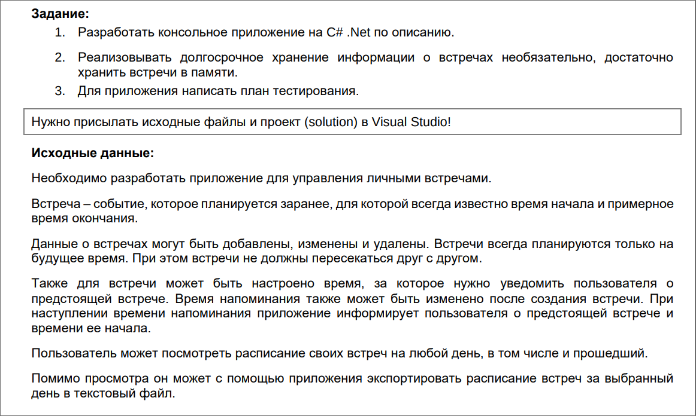
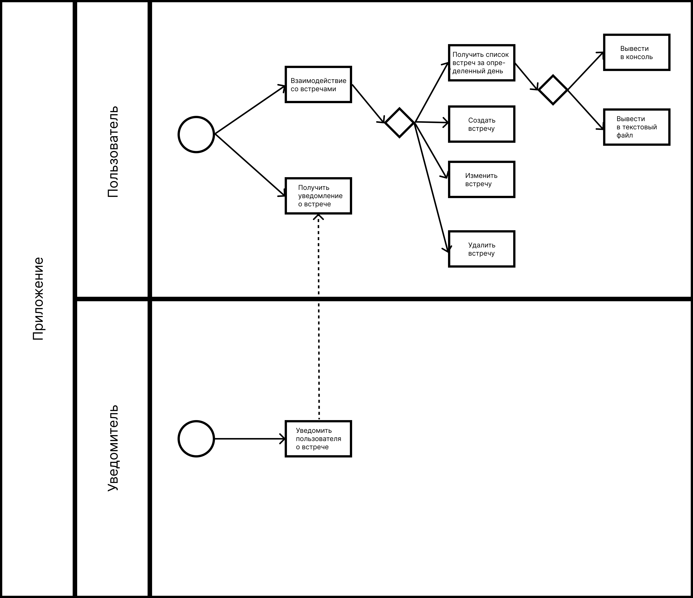

## Задание

## Решение
Сначала была сделана диаграмма BPMN для большего понимания, какой функционал необходимо разработать.

Далее было создано два проекта:
- Application - консольный проект с необходимым функционалом;
- Tests - проект для автоматизированного тестирования функционала.

Необходимо запускать две консоли:
- dotnet run --project Application
- dotnet run --project Application notify

Первая консоль обладает основным функционалом, вторая консоль нужна для вывода напоминаний о встречах.

Для проведения тестирования был написан план тестирования (см. файл "План тестирования.docx").
